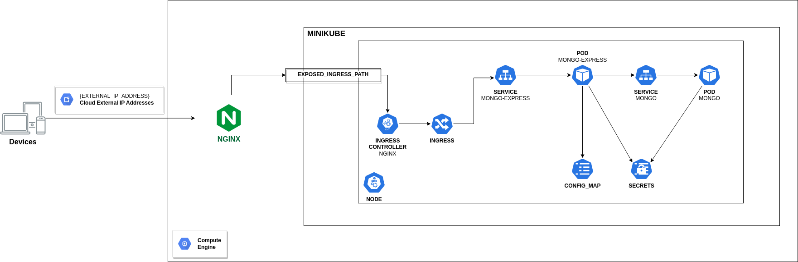

# Mongo Express & MongoDB in Kubernetes

My main goal is to create a K8s cluster with MongoDB and mongoExpress.
For practice I create a compute engine in Google Cloud Platform and there installed minikube.

### Tasks to be carried out

 * Create Deployment PODs for mongo-express & MongoDB
 * Create Secrets for MongoDB environments & Mongo-Express
 * Create Services for the 2 PODs for communication.
 * ConfigMap for MongoExpress to indicate which database must connects.
 * Ingress for request from broswer mongo-express.
 * Configure NGINX

*****

### Communication Flow



******

### WorkFlow

Configure all YAML files for mongo-express & mongoDB Deployment PODs. Create Services for internal communication of PODs. Mongo-Express POD must communicate with MongoDB POD. Here we need **Ingress** because Ingress will fetch the requests from broswer and after will redirect them to my internal service MONGO-EXPRESS-SERVICE. 

Ingress achieve the communication outside from **Minikube** using an **Ingress Controller**. In this project used minkikube **nginx-ingress-controller**. Ingress-Controller evaluate all the rules that defined in K8s cluster and this way manage all the redirections. 

But minikube has its own ip address and our ingress rules use the host ```foo.bar.com/``` for mongo-express-service. So we have to redirect minikube ip to ***foo.bar.com***.

***Steps for redirect minikube ip ---> foo.bar.com***

```bash
#Find minikube Ip      
$ minikube ip

# Redirect 
$ sudo vim /etc/hosts

#Add the line above with your configurations
{minikube_ip} foo.bar.com

#Check if redirectio happens succesufully
$ curl foo.bar.com
```

Finally nginx-ingress-controller is accessible outside of minkube. But the problem is that we can not have access to nginx-ingress-controller from a broswer, because we must expose nginx-controller outside from GCP compute-engine. We succeed it using a proxy. In this project I used **NGINX**.

```bash
#Install nginx
$ sudo apt update
$ sudo apt install nginx

#edit the folder in path
$ sudo vim /etc/nginx/conf.d/upstream.conf

#copy paste and configure the following commands
upstream foo.bar.com {
     server foo.bar.com;
}
server {
     listen 80;
     server_name {gcp_external_ip_address};
     location / {
        proxy_pass http://foo.bar.com;
     }
}

# restart nginx
$ sudo systemctl reload nginx
```

You are ready :v:

Go in broswer and visit mongo-express: ```http://{gcp_external_ip_address}```

